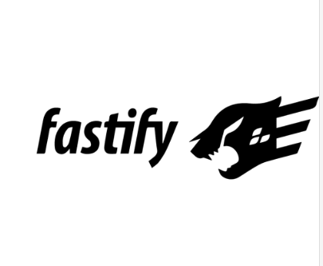

# Hi everyone

## About me
I'm a junior fullstack developer, now I',I am currently learning the Vue javascript framework, Nuxt Js and Python
## Contact 
You can contact me at this email mvazquezcostal@gmail.com or on my LinkedIn profile https://www.linkedin.com/in/mauricio-santiago-vazquez-costal/

## Portofolio

If you can see my works you can see in this [Link](https://portafolio-mauriciosantiago.vercel.app/)
## My stack

